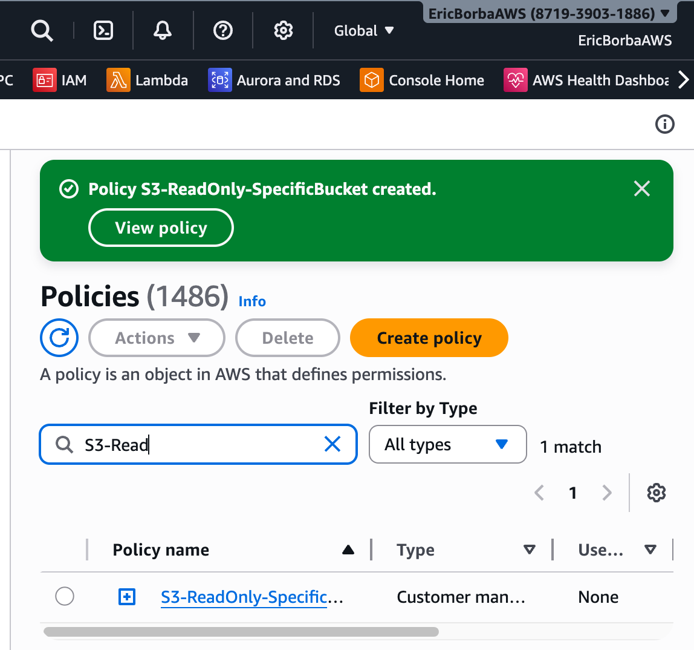
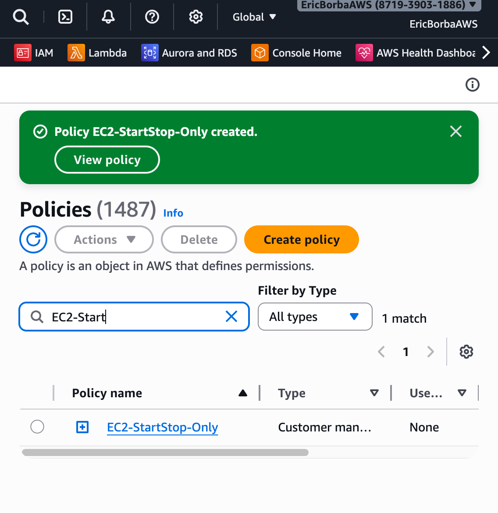
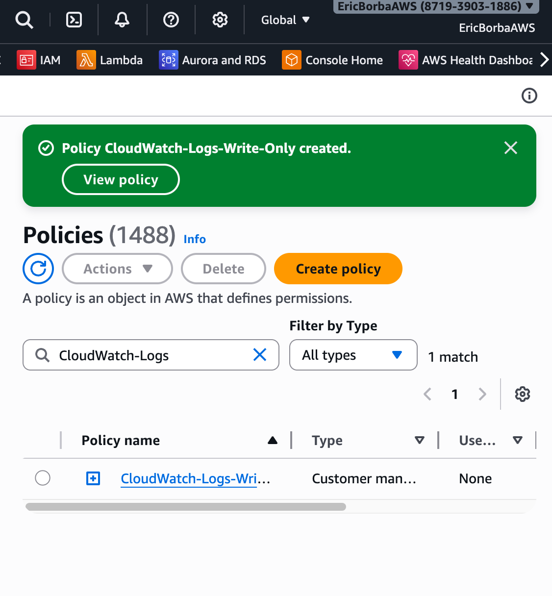
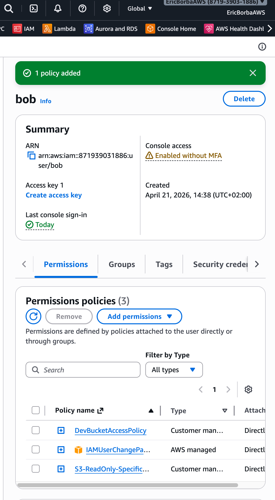
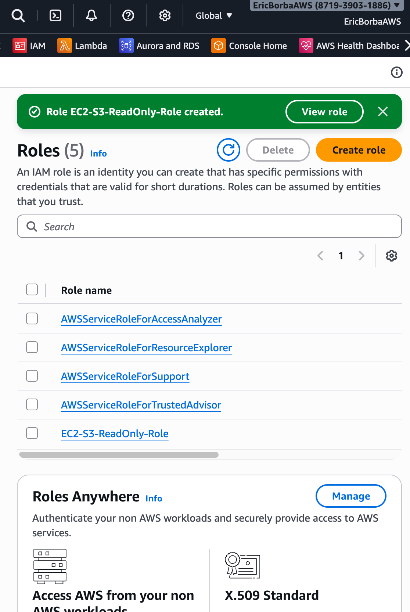
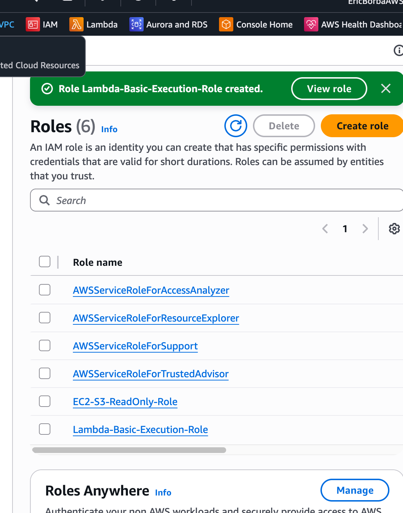
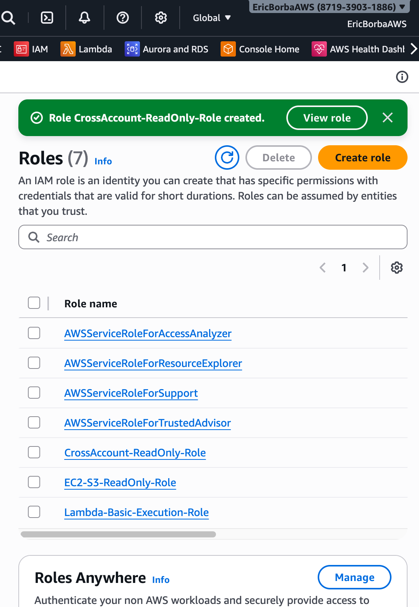
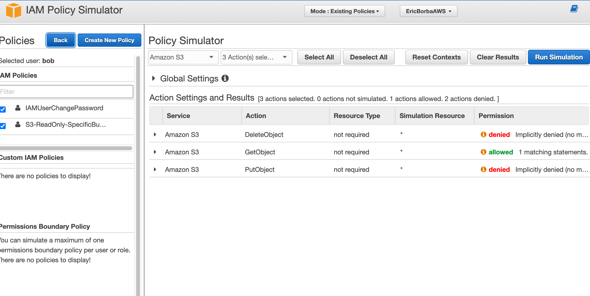

# Lab Solution: IAM Policies and Roles

**Student Name:** Eric Rodrigues Borba  
**Date:** 21/04/2026  
**Lab Completion Time:** 110 minutes

---

## Part 1: Understanding IAM Policy Structure

### Task 1: Policy Components Explanation

**Explain each component in your own words:**

**Version:**
```
A fixed date that tells AWS which version of the policy language you're using
```

**Statement:**
```
The actual list of rules. A policy can have multiple statements, each defining a different set of permissions.
```

**Sid:**
```
An optional label you give to a statement so it's easier to identify later (helps with Organizations).
```

**Effect:**
```
Either Allow or Deny. You are grating or blocking the actions.
```

**Action:**
```
What the user is allowed (or denied) to do. You can list multiple actions or use a wildcard like s3:* to cover everything.
```

**Resource:**
```
Which specific AWS resource this rule applies to, identified by its ARN. You can target a single resource like a specific S3 bucket, for example.
```

---

## Part 2: Custom IAM Policies Created

### S3 Read-Only Policy

**Policy Name:** S3-ReadOnly-SpecificBucket

**Bucket Name Used:** dev-bucket-ericborba

**Policy JSON:**
```json
{
    "Version": "2012-10-17",
    "Statement": [
        {
            "Sid": "ListSpecificBucket",
            "Effect": "Allow",
            "Action": [
                "s3:ListBucket"
            ],
            "Resource": "arn:aws:s3:::dev-bucket-ericborba"
        },
        {
            "Sid": "ReadObjectsInBucket",
            "Effect": "Allow",
            "Action": [
                "s3:GetObject",
                "s3:GetObjectVersion"
            ],
            "Resource": "arn:aws:s3:::dev-bucket-ericborba/*"
        }
    ]
}
```

**Screenshot 1: S3 Custom Policy**


---

### EC2 Start/Stop Policy

**Policy Name:** EC2-StartStop-Only

**Policy ARN:** arn:aws:iam::871939031886:policy/EC2-StartStop-Only

**Screenshot 2: EC2 Custom Policy**


---

### CloudWatch Logs Write Policy

**Policy Name:** CloudWatch-Logs-Write-Only

**Policy ARN:** arn:aws:iam::871939031886:policy/CloudWatch-Logs-Write-Only

**Screenshot 3: CloudWatch Logs Policy**


---

## Part 3: Policy Attachments

### Policy Attached to User

**User Name:** bob

**Policy Attached:** S3-ReadOnly-SpecificBucket

**Attachment Method:** x Console ☐ CLI

**CLI Command (if used):**
```bash
aws iam list-policies --scope Local --query 'Policies[?PolicyName==`S3-ReadOnly-SpecificBucket`].Arn' --output text

aws iam attach-user-policy \
  --user-name bob \
  --policy-arn arn:aws:iam::871939031886:policy/S3-ReadOnly-SpecificBucket
```

**Screenshot 4: Policy Attached**


---

## Part 4: IAM Roles Created

### EC2 Service Role

**Role Name:** EC2-S3-ReadOnly-Role

**Role ARN:** arn:aws:iam::871939031886:role/EC2-S3-ReadOnly-Role

**Trusted Entity:** AWS Service: EC2 (ec2.amazonaws.com)

**Attached Policies:**
1. AmazonS3ReadOnlyAccess

**Trust Relationship JSON:**
```json
{
    "Version": "2012-10-17",
    "Statement": [
        {
            "Effect": "Allow",
            "Principal": {
                "Service": "ec2.amazonaws.com"
            },
            "Action": "sts:AssumeRole"
        }
    ]
}
```

**Screenshot 5: EC2 Service Role**


---

### Lambda Execution Role

**Role Name:** Lambda-Basic-Execution-Role

**Role ARN:** arn:aws:iam::871939031886:role/Lambda-Basic-Execution-Role

**Attached Policies:**
1. AWSLambdaBasicExecutionRole
2. CloudWatch-Logs-Write-Only

**Screenshot 6: Lambda Role**


---

### Cross-Account Access Role

**Role Name:** CrossAccount-ReadOnly-Role

**Role ARN:** arn:aws:iam::871939031886:role/CrossAccount-ReadOnly-Role

**External Account ID:** 871939031886

**External ID:** unique-external-id-123

**Attached Policies:**
1. ReadOnlyAccess

**Screenshot 7: Cross-Account Role**


---

## Part 5: Policy Testing

### Policy Simulator Results

**Policy Tested:** ___________________________

**Test Results:**

| Action | Expected Result | Actual Result | Pass/Fail |
|--------|----------------|---------------|-----------|
| s3:GetObject | Allowed | | x Pass ☐ Fail |
| s3:PutObject | Denied | | x Pass ☐ Fail |
| s3:DeleteObject | Denied | | x Pass ☐ Fail |

**Screenshot 8: Policy Simulator**


---

### AWS CLI Testing

**Test 1: S3 List Bucket**
```bash
# Command:
aws s3 ls s3://dev-bucket-ericborba --profile alice
# Output:
2026-04-21 18:12:37          6 test2.txt


# Result: x Success ☐ Access Denied
```

**Test 2: S3 Upload File**
```bash
# Command:
echo "test" > test.txt                          
aws s3 cp test.txt s3://dev-bucket-ericborba --profile alice
# Output:

upload failed: ./test.txt to s3://dev-bucket-ericborba/test.txt An error occurred (AccessDenied) when calling the PutObject operation: User: arn:aws:iam::871939031886:user/alice is not authorized to perform: s3:PutObject on resource: "arn:aws:s3:::dev-bucket-ericborba/test.txt" because no identity-based policy allows the s3:PutObject action


# Result: ☐ Success x Access Denied (Expected)
```

**Test 3: S3 Download File**
```bash
# Command:
aws s3 cp s3://dev-bucket-ericborba/test2.txt ./ --profile alice
# Output:

download: s3://dev-bucket-ericborba/test2.txt to ./test2.txt   

# Result: x Success ☐ Access Denied
```

---

## Part 6: Least Privilege Implementation

### Custom Policy with Conditions

**Policy Name:** S3ReadOnlyCorpNetworkPolicy

**Condition Type Used:** x IP Address x Time Window ☐ MFA ☐ Other: _______

**Policy JSON:**
```json
{
  "Version": "2012-10-17",
  "Statement": [
    {
      "Sid": "AllowS3ReadOnlyFromCorpNetwork",
      "Effect": "Allow",
      "Action": [
        "s3:GetObject",
        "s3:ListBucket"
      ],
      "Resource": [
        "arn:aws:s3:::YOUR-BUCKET-NAME",
        "arn:aws:s3:::YOUR-BUCKET-NAME/*"
      ],
      "Condition": {
        "IpAddress": {
          "aws:SourceIp": "203.0.113.0/24"
        }
      }
    },
    {
      "Sid": "ExplicitDenyUploadAndDelete",
      "Effect": "Deny",
      "Action": [
        "s3:PutObject",
        "s3:DeleteObject",
        "s3:DeleteBucket"
      ],
      "Resource": "*"
    }
  ]
}
```

**Rationale for this policy:**
```
-Replaced the broad s3:* wildcard with only GetObject and ListBucket — least privilege principle
-Scoped Resource to the specific bucket instead of "*"
- Added an explicit Deny for upload and delete actions as a second layer of protection (a Deny always overrides an Allow in AWS IAM)
```

**Policy JSON:**
```json
{
  "Version": "2012-10-17",
  "Statement": [
    {
      "Sid": "AllowS3ReadOnlyWithinTimeAndIP",
      "Effect": "Allow",
      "Action": [
        "s3:GetObject",
        "s3:ListBucket"
      ],
      "Resource": [
        "arn:aws:s3:::YOUR-BUCKET-NAME",
        "arn:aws:s3:::YOUR-BUCKET-NAME/*"
      ],
      "Condition": {
        "IpAddress": {
          "aws:SourceIp": "203.0.113.0/24"
        },
        "DateGreaterThan": {
          "aws:CurrentTime": "2026-01-14T00:00:00Z"
        },
        "DateLessThan": {
          "aws:CurrentTime": "2026-12-31T23:59:59Z"
        },
        "Bool": {
          "aws:SecureTransport": "true"
        }
      }
    }
  ]
}
```

**Rationale for this policy:**
```
-aws:SecureTransport: true — enforces HTTPS, blocks any plain HTTP requests
-A realistic time window with an expiration date
-All conditions are evaluated together with AND logic — IP and time window and HTTPS must all be true for access to be granted
```
---

## Part 7: Troubleshooting

### Issue Encountered (if any)

**Issue Description:**
```
_____________________________________________________________
_____________________________________________________________
_____________________________________________________________
```

**Commands Used to Diagnose:**
```bash
_____________________________________________________________
_____________________________________________________________
_____________________________________________________________
```

**Resolution:**
```
_____________________________________________________________
_____________________________________________________________
_____________________________________________________________
```

**Screenshot 9: Troubleshooting Output**


---

## Reflection Questions

### 1. Why are IAM roles preferred over access keys for EC2 instances?

**Your answer:**
```
When you use access keys, you have to store them somewhere on the EC2 instance, which is a 
security risk if someone gains access to that machine. IAM roles automatically provide 
temporary credentials that rotate behind the scenes, so there is nothing hardcoded to steal.
It is simply a cleaner and safer way to grant permissions to an instance.
```

### 2. Explain the principle of least privilege and how you applied it in this lab.

**Your answer:**
```
Least privilege means giving a user or service only the permissions it actually needs, nothing 
more. In this lab we granted read only access to a specific S3 bucket, allowing just 
ListBucket and GetObject actions. We then validated that approach using the policy simulator, 
which confirmed that PutObject and DeleteObject were properly denied.
```

### 3. What is the difference between identity-based and resource-based policies?

**Your answer:**
```
Identity-based policies are attached to a user, group or role and define what that entity can do.
Resource-based policies are attached directly to a resource like an S3 bucket and define who can access it.
```

### 4. When would you use an explicit "Deny" in a policy?

**Your answer:**
```
You use an explicit Deny when you want to make absolutely sure certain actions can never happen, 
even if another policy grants them. In Part 6 I added a Deny for PutObject, DeleteObject and 
DeleteBucket to guarantee that no one could upload or destroy files in the bucket regardless 
of other permissions.
```

### 5. Describe a scenario where you'd use conditions in IAM policies.

**Your answer:**
```
A good example is when you want to allow access only from your company network and within 
business hours. In Part 6 I did exactly that by combining an IP address condition to restrict 
access to a specific CIDR range and a time window condition to limit access to a defined period, 
making sure that even valid users could not access the bucket outside those boundaries.
```

---

## Summary of Resources Created

**IAM Policies:**
1. S3-ReadOnly-SpecificBucket        (ARN: arn:aws:iam::871939031886:policy/S3-ReadOnly-SpecificBucket)
2. EC2-StartStop-Only                (ARN: arn:aws:iam::871939031886:policy/EC2-StartStop-Only)
3. CloudWatch-Logs-Write-Only        (ARN: arn:aws:iam::871939031886:policy/CloudWatch-Logs-Write-Only)

**IAM Roles:**
1. EC2-S3-ReadOnly-Role              (ARN: arn:aws:iam::871939031886:role/EC2-S3-ReadOnly-Role)
2. Lambda-Basic-Execution-Role       (ARN: arn:aws:iam::871939031886:role/Lambda-Basic-Execution-Role)
3. CrossAccount-ReadOnly-Role        (ARN: arn:aws:iam::871939031886:role/CrossAccount-ReadOnly-Role)

**Users Modified:**
1. bob
2. alice

---

## Cleanup Confirmation

- [x] Detached all custom policies from users
- [x] Deleted custom IAM policies
- [x] Detached policies from roles
- [x] Deleted test IAM roles
- [x] Verified no resources remain

**Cleanup Commands:**
```bash
aws iam detach-user-policy --user-name bob --policy-arn arn:aws:iam::871939031886:policy/S3-ReadOnly-SpecificBucket

aws iam delete-policy --policy-arn arn:aws:iam::871939031886:policy/S3-ReadOnly-SpecificBucket

aws iam detach-role-policy --role-name EC2-S3-ReadOnly-Role --policy-arn arn:aws:iam::aws:policy/AmazonS3ReadOnlyAccess

aws iam delete-role --role-name EC2-S3-ReadOnly-Role
```

---

## Self-Assessment

**Rate your understanding (1-5):**

| Concept | Before Lab | After Lab | Improvement |
|---------|-----------|-----------|-------------|
| IAM Policy Structure | 1/5 | 4/5 | +___ |
| Custom Policy Creation | 1/5 | 4/5 | +___ |
| IAM Roles | 1/5 | 4/5 | +___ |
| Service Roles | 1/5 | 4/5 | +___ |
| Trust Relationships | 1/5 | 2/5 | +___ |
| Policy Testing | 1/5 | 4/5 | +___ |
| Least Privilege | 1/5 | 4/5 | +___ |
| Troubleshooting IAM | 1/5 | 4/5 | +___ |

---

## Instructor Verification

**Instructor Name:** 

**Date Reviewed:** ___________________________

**All policies validated:** ☐ Yes ☐ No

**Roles properly configured:** ☐ Yes ☐ No

**Comments:**
```
_____________________________________________________________
_____________________________________________________________
_____________________________________________________________
```

**Grade/Status:** ___________________________

---

**Lab Status:** ☐ Complete ☐ Needs Revision

**Submission Date:** ___________________________
